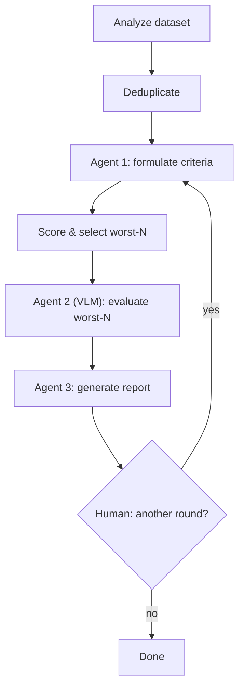

# agentic-image-dataset-cleaner

[](https://www.python.org/downloads/)
[](LICENSE)
[](tests/)

Remove low-quality photos from your image dataset faster, with a small team
of LLM agents doing the triage and a human making the final call.

You point it at a folder of images. It comes back with a ranked list of the
worst offenders — blurry, over/underexposed, noisy, duplicated, badly
cropped — each with a visual diagnosis and a suggested action, so you're
reviewing a short list instead of scrolling through thousands of thumbnails.

**Contents:** [Why agents](#why-agents-and-why-not-just-agents) ·
[How it works](#how-it-works) ·
[Design decisions](#key-findings--design-decisions) ·
[Quickstart](#quickstart) ·
[Project layout](#project-layout) ·
[Testing](#testing) ·
[Running at scale](#running-it-at-scale) ·
[Roadmap](#roadmap)

## Why agents, and why not *just* agents

Fully deterministic quality metrics (blur variance, exposure, noise) are
fast and cheap, but they're proxies — a low-contrast photo isn't always a
bad photo. A vision-language model can actually *look* at an image, but
it's slow and expensive to run over an entire dataset, and it can
hallucinate or anchor on whatever it's shown.

So the pipeline splits the work by what each side is actually good at:

- **Deterministic code** does the cheap, dataset-wide pass: metrics,
  near-duplicate detection, and score-based ranking. It also owns anything
  that must be reproducible and auditable, like which direction a metric
  counts as "bad" — that's never left to the LLM.
- **Agents** are reserved for judgment calls: which quality problems
  actually matter for *this* dataset (Agent 1), whether a deterministically
  flagged sample is really bad when you look at it (Agent 2, the VLM), and
  what to actually do about it (Agent 3).
- **A human** approves or declines every additional review round, and (once
  the UI lands — see [Roadmap](#roadmap)) will get to look at exactly the
  samples flagged for deletion before anything is actually removed.

## How it works

At a glance: **deterministic pass → Agent 1 sets criteria → deterministic
scoring → Agent 2 (VLM) verifies the worst offenders → Agent 3 writes the
report → human approves or declines another round.**



1. **Analyze** — every image gets deterministic metrics: blur, exposure,
   contrast, noise, a perceptual hash, plus corruption detection.
2. **Deduplicate** — near-duplicate clusters (by pHash) are resolved before
   anything else, so duplicates never eat into the VLM review budget.
3. **Agent 1 (criteria)** — looks at the dataset's aggregate statistics and
   decides which metrics matter for this specific dataset and how much to
   weight each one. It does *not* decide metric direction (see
   [Design Decisions](#key-findings--design-decisions)) — that's fixed in
   code.
4. **Score & select worst-N** — deterministic composite scoring ranks every
   sample; the worst N go on to visual review.
5. **Agent 2 (VLM)** — actually looks at each of the worst-N images and
   confirms, downgrades, or dismisses the deterministic suspicion, with a
   severity and a short visual description.
6. **Agent 3 (report)** — combines the score, the VLM finding, and its own
   judgment into a suggested action per sample (`delete`, `relabel`,
   `recrop`, `enhance`, `keep_review`, `keep`), plus a round-level summary
   and an optional proposal for what to change next round.
7. **Human-in-the-loop** — if Agent 3 proposes another round, the pipeline
   pauses (via LangGraph's `interrupt()`) and waits for an explicit
   approve/decline before continuing or finishing.

## Key findings & design decisions

During validation, several issues were identified and addressed:

* **Exposure-independent sharpness:** `blur_variance` is computed on a histogram-equalized image to prevent underexposure from being misclassified as blur. The raw Laplacian variance is preserved as `blur_variance_raw` for diagnostics.
* **Robust scoring:** `composite_score` uses a max-floor in addition to the weighted sum, preventing a catastrophic defect on one metric from being cancelled out by artificially good values on correlated metrics. `weighted_sum_score` is used as a deterministic tiebreaker.
* **Deterministic deduplication:** Near-duplicates are removed before scoring and VLM evaluation. Connected pHash components are clustered and the sharpest representative is kept, preventing duplicates from consuming the VLM budget.
* **Anti-anchoring:** Agent 3 is explicitly instructed not to equate worst-N membership with deletion. The application also detects suspiciously uniform recommendations and emits a warning.
* **Metric directions are deterministic:** Agent 1 no longer chooses whether a metric is `low_is_bad` or `high_is_bad`. Directions are defined in code from the mathematical meaning of each metric, while the agent only selects relevant metrics and their weights.
* **Tail-aware criteria selection:** Agent 1 receives explicit severity hints showing the relevant bad-tail percentile and its ratio to the median. This prevents metrics such as `blur_variance` from being incorrectly dismissed based only on their median.
* **Clean validation dataset:** Standalone degradations are generated from images without sharp counterparts in the dataset, separating scoring validation from deduplication validation. On the clean benchmark, scoring identified **14/15 standalone degradations in worst-20**, while the corrected metric direction brought **5/5 severely blurred samples** into worst-20.

## Quickstart

**Requirements:** Python 3.12+, a [Groq](https://console.groq.com) API key.

```bash
git clone https://github.com/McQbis/agentic-image-dataset-cleaner.git
cd agentic-image-dataset-cleaner
pip install -r requirements.txt

cp .env.example .env
# then edit .env and set at least GROQ_API_KEY, TEXT_MODEL, VLM_MODEL
```

Set the dataset path in the script (or generate the synthetic dogs dataset used in
testing — see `build_dogs_test_dataset.py` for instructions) and run:

```bash
python run_locally.py
```

This runs the whole pipeline synchronously, in one process. It's the
simplest way to use the project — no queue, no broker, nothing else to
stand up.

<details>
<summary>Example output</summary>

```
Analyzing dataset at 'datasets/dogs_raw'... It may take a few minutes for large datasets.

================================================================================
Human review required
================================================================================
Reviewed 20 samples: 6 flagged for deletion (severe blur or exposure issues),
4 flagged for relabeling, the rest kept or queued for enhancement.

Sample findings:
DELETE: datasets/dogs_raw/img_0421.jpg
DELETE: datasets/dogs_raw/img_0733.jpg
DELETE: datasets/dogs_raw/img_1042.jpg
...

Run another round? [y/N]: n

================================================================================
Pipeline completed
================================================================================
Status: completed
```

</details>

## Project layout

```
core/                    domain logic — no infrastructure dependencies
├── agents/               Agent 1 (criteria), Agent 2 (VLM), Agent 3 (report)
├── tools/                deterministic analysis, dedup, scoring
├── orchestration/        LangGraph graph + PipelineDeps port + state
└── schemas.py            canonical Pydantic contracts for the whole pipeline

infra/                    optional Celery + Redis wiring for distributed
                          execution (see infra/README.md) — depends on
                          core/, never the other way around

tests/
├── unit/                 deterministic tools, no external dependencies
└── integration/          real LangGraph graph, fake or Celery-backed deps

run_locally.py            CLI entrypoint: runs everything in one process
run_distributed.py        CLI entrypoint: dispatches each stage to Celery
build_dogs_test_dataset.py  builds the synthetic dataset used for validation
```

`core/` is deliberately the only thing you need to actually use this
project. Everything else is either a CLI entrypoint or an optional layer
built on top of it.

## Testing

```bash
python -m pytest
```

Unit tests cover the deterministic tools (scoring, dedup, analysis) in
isolation. Integration tests run the real LangGraph graph end-to-end,
including the `interrupt()`/resume human-review boundary, against both a
synchronous fake (`FakeDeps`) and, if you're also touching `infra/`, the
Celery-backed `PipelineDeps` running in Celery's eager mode — no broker
required for either.

## Running it at scale

There's an optional `infra/` folder that lets the same pipeline run behind
Celery + Redis instead of a single process, via `run_distributed.py`. It's
a training exercise toward a future SaaS version of this project and is
fully decoupled from `core/` — delete `infra/` and `run_locally.py` still
works exactly as before. See [`infra/README.md`](infra/README.md) for setup
and the gotchas (mainly: the worker needs its own view of the dataset
directory).

## Roadmap

- **Human review UI.** Right now, deciding whether to run another round is
  a plain `y/N` prompt, and the suggested `delete` actions are only printed
  to the terminal. The plan is a real UI where a human sees the flagged
  samples and decides which ones actually get removed before the next
  round starts (or before the pipeline finishes) — the pipeline already
  pauses at exactly the right point (`AWAITING_USER_DECISION`) for this.
- **A thin API layer** (FastAPI) in front of `run_distributed.py`, so a run
  can be triggered and polled instead of run as a blocking CLI script.
  `RunStatus` in `core/schemas.py` already anticipates this.

## License

[MIT](LICENSE)